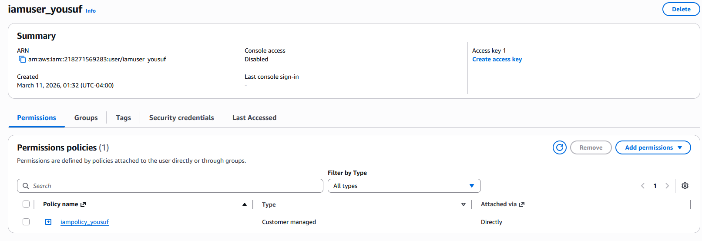

# Day 19: Attach IAM Policy to IAM User

## 📋 Project Overview

Attached an IAM policy to an IAM user using AWS CLI. This is the critical step that grants actual permissions - until a policy is attached, users have zero access to AWS resources. This day demonstrates connecting the IAM components built over Days 16-18 into a functioning access control system.

---

## 🎯 Objective

Attach an existing IAM policy to an existing IAM user with the following requirements:
- **User**: `iamuser_yousuf` (already exists)
- **Policy**: `iampolicy_yousuf` (already exists)
- **Action**: Attach the policy to the user
- **Method**: AWS CLI

---

## 🛠️ Implementation

### Command Used


```bash
# Attach IAM policy to IAM user
aws iam attach-user-policy \
  --policy-arn arn:aws:iam::218271569283:policy/iampolicy_yousuf \
  --user-name iamuser_yousuf
```

**Syntax Breakdown:**
- `attach-user-policy` - Attaches a managed policy to a user
- `--policy-arn` - The Amazon Resource Name of the policy to attach
- `--user-name` - The user to attach the policy to

---

### Verification



✅ **Policy successfully attached to user!**

---

## 📚 What I Learned

### **What Does Attaching a Policy Do?**

**Before Attachment:**
```
iamuser_yousuf → Zero permissions ❌
iampolicy_yousuf → Defines permissions but not used
```

**After Attachment:**
```
iamuser_yousuf → Has permissions defined in iampolicy_yousuf ✅
```

**Now the user can actually perform the actions specified in the policy!**

---

### **Understanding the Policy ARN**

```
arn:aws:iam::218271569283:policy/iampolicy_yousuf
 │    │    │       │              │
 │    │    │       │              └── Resource: policy/iampolicy_yousuf
 │    │    │       └── Account ID: 218271569283
 │    │    └── Service: iam
 │    └── Partition: aws
 └── Prefix: arn
```

**Why use ARN instead of just the policy name?**
- ARNs are globally unique across all AWS accounts
- Allows referencing policies in other accounts (cross-account access)
- Prevents ambiguity if multiple policies have similar names

---

### **Attaching to User vs Attaching to Group**

**Two Ways to Grant Permissions:**

**Option 1: Attach to User Directly** (What we did)
```bash
aws iam attach-user-policy \
  --user-name iamuser_yousuf \
  --policy-arn arn:aws:iam::218271569283:policy/iampolicy_yousuf
```

**Option 2: Attach to Group** (Best Practice)
```bash
# Create/use a group
aws iam attach-group-policy \
  --group-name developers \
  --policy-arn arn:aws:iam::218271569283:policy/iampolicy_yousuf

# Add user to group
aws iam add-user-to-group \
  --user-name iamuser_yousuf \
  --group-name developers
```

**Best Practice:** Attach policies to groups (Day 17), then add users to groups. This makes managing many users much easier.

---


### **Multiple Policies Can Be Attached**

A user can have multiple policies attached:

```bash
# User can have policy 1
aws iam attach-user-policy \
  --user-name iamuser_yousuf \
  --policy-arn arn:aws:iam::ACCOUNT:policy/policy1

# AND policy 2
aws iam attach-user-policy \
  --user-name iamuser_yousuf \
  --policy-arn arn:aws:iam::ACCOUNT:policy/policy2

# AND policy 3...
```

**Permissions are cumulative** - user gets the union of all attached policies.


---

## 🔑 Key Takeaways

1. **Attachment Grants Permissions**: Users have zero access until policies are attached

2. **ARN is Required**: Must use full ARN, not just policy name

3. **Immediate Effect**: Permissions are active as soon as policy is attached

4. **Multiple Policies Allowed**: Users can have many policies (permissions are cumulative)

5. **Managed Policies are Reusable**: Same policy can be attached to multiple users/groups

6. **Best Practice: Use Groups**: Attach to groups, not individual users (except special cases)

7. **Customer vs AWS Managed**: ARN shows who created the policy (account ID vs "aws")

---

## 📖 Resources

- [AWS CLI attach-user-policy Reference](https://docs.aws.amazon.com/cli/latest/reference/iam/attach-user-policy.html)
- [IAM Policy Attachment Documentation](https://docs.aws.amazon.com/IAM/latest/UserGuide/access_policies_manage-attach-detach.html)

---

## ✅ Project Status

**Status**: Completed ✅  
**Date**: February 19, 2026  
**User**: `iamuser_yousuf`  
**Policy**: `iampolicy_yousuf`  
**Policy ARN**: `arn:aws:iam::218271569283:policy/iampolicy_yousuf`  
**Account ID**: `218271569283`  
**Method**: AWS CLI  
**Effect**: Immediate - user now has permissions defined in policy  

---

## 🤔 Reflection

**What I Learned:**
- Attaching a policy is what actually grants permissions to a user
- Policy ARNs are required (full Amazon Resource Name, not just policy name)
- Permissions take effect immediately after attachment
- Multiple policies can be attached to one user (permissions are cumulative)
- Best practice is to attach policies to groups, not individual users

**Key Insight:**
This is the day everything comes together! Days 16-18 were building individual components (users, groups, policies), but they didn't do anything by themselves. Day 19 is the "connection day" that makes the IAM system functional.

**Professional Takeaway:**
Policy attachment is where IAM theory becomes practice. Understanding the difference between having a user (identity) and granting that user permissions (policy attachment) is fundamental to AWS security. This distinction prevents the common mistake of wondering "why can't my user access anything?" when policies haven't been attached.

---

**Tags**: #AWS #IAM #Policy #Attachment #Permissions #AccessControl #Security #CLI #100DaysOfCloud
