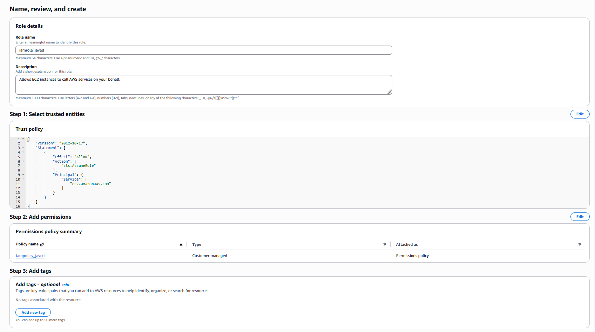
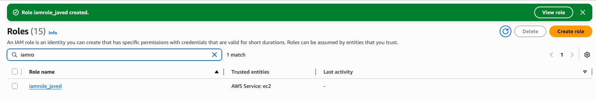

# Day 20: Create IAM Role for EC2 with Policy Attachment

## 📋 Project Overview

Created an IAM role for EC2 instances using the AWS Console and attached a policy to it. This completes the IAM fundamentals series (Days 16-20) and demonstrates understanding of how AWS services authenticate and access other AWS resources through roles rather than hardcoded credentials.

---

## 🎯 Objective

Create an IAM role with the following requirements:
- **Role Name**: `iamrole_javed`
- **Entity Type**: AWS Service
- **Use Case**: EC2
- **Attached Policy**: `iampolicy_javed`
- **Method**: AWS Console

---

## 🛠️ Implementation

### Method: AWS Console (Web Interface)

**Steps Taken:**

1. Navigate to **IAM Dashboard** → **Roles** → **Create role**

2. **Select trusted entity type:**
   - Choose **AWS Service**
   - Use case: **EC2**

3. **Attach permissions policy:**
   - Search for and select `iampolicy_javed`

4. **Name the role:**
   - Role name: `iamrole_javed`

5. **Create role**



---

### Verification



✅ **IAM role successfully created with policy attached!**

---

## 📚 What I Learned

### **What is an IAM Role?**

An IAM role is a set of **permissions** that can be **assumed** by AWS services or users temporarily.

**Key Difference from Users:**

| IAM User | IAM Role |
|----------|----------|
| Permanent identity | Temporary credentials |
| Has password/access keys | No long-term credentials |
| For people/applications | For AWS services |
| Credentials stored | Credentials auto-rotated |

**Think of it as:** A "hat" that an AWS service can wear to get permissions temporarily.

---

### **Why EC2 Needs Roles**

**The Problem Without Roles:**

```
EC2 instance needs to access S3
❌ Bad approach: Hardcode AWS access keys in the application
   - Keys can be stolen
   - Keys don't rotate
   - Must update every instance if keys change
```

**The Solution With Roles:**

```
EC2 instance assumes IAM role
✅ Good approach: Role gives temporary credentials
   - No hardcoded credentials
   - Auto-rotated every few hours
   - Revoke by removing role (no key hunting)
```

---

### **Understanding "AWS Service" Entity Type**

When creating a role, you choose **who can assume it:**

| Entity Type | Who Can Use It | Example |
|-------------|----------------|---------|
| **AWS Service** | AWS services (EC2, Lambda, etc.) | EC2 instance accessing S3 |
| **Another AWS account** | Users from different AWS account | Cross-account access |
| **Web identity** | Users from Google/Facebook login | Mobile app users |
| **SAML 2.0 federation** | Corporate identity provider | Single sign-on |

**We chose AWS Service → EC2** because we want EC2 instances to assume this role.

---

### **Roles vs Users: When to Use Each**

| Use Case | Solution |
|----------|----------|
| Person logs into AWS Console | IAM User |
| Application on EC2 needs S3 access | IAM Role (for EC2) |
| Lambda function needs DynamoDB access | IAM Role (for Lambda) |
| Developer needs CLI access | IAM User with access keys |
| Cross-account access needed | IAM Role (for another account) |
| Third-party service needs AWS access | IAM Role (with external ID) |

---

## 🔑 Key Takeaways

1. **Roles are for Services**: While users are for people, roles are primarily for AWS services

2. **No Long-Term Credentials**: Roles provide temporary credentials that auto-rotate

3. **Trust + Permissions**: Roles have trust policy (who can assume) and permissions policy (what they can do)

4. **EC2 Use Case**: Allows EC2 instances to assume the role and get temporary credentials

5. **Better Than Hardcoding**: Never hardcode AWS credentials in applications - use roles instead

6. **IAM Best Practice**: Applications on EC2 should always use roles, never access keys

7. **Completes IAM Basics**: Days 16-20 cover the full IAM foundation (users, groups, policies, roles)

---

## 📖 Resources

- [IAM Roles Documentation](https://docs.aws.amazon.com/IAM/latest/UserGuide/id_roles.html)
- [Using IAM Roles with EC2](https://docs.aws.amazon.com/AWSEC2/latest/UserGuide/iam-roles-for-amazon-ec2.html)
- [IAM Best Practices - Use Roles](https://docs.aws.amazon.com/IAM/latest/UserGuide/best-practices.html#use-roles-with-ec2)

---

## ✅ Project Status

**Status**: Completed ✅  
**Date**: February 20, 2026  
**Role Name**: `iamrole_javed`  
**Entity Type**: AWS Service  
**Use Case**: EC2  
**Attached Policy**: `iampolicy_javed`  
**Trust Policy**: Allows EC2 service to assume role  
**Method**: AWS Console  

---

## 🤔 Reflection

**What I Learned:**
- IAM roles provide temporary credentials for AWS services
- Roles are different from users - no long-term credentials
- EC2 instances use roles instead of hardcoded access keys
- Every role has a trust policy (who can assume) and permissions policy (what they can do)
- The "AWS Service → EC2" selection creates a trust policy allowing EC2 to assume the role

**Key Insight - The IAM Series Complete:**

Days 16-20 taught me the four pillars of AWS IAM:
1. **Users** - Identities for people (Day 16)
2. **Groups** - Organizational containers (Day 17)
3. **Policies** - Permission definitions (Day 18)
4. **Attachment** - Connecting policies to users (Day 19)
5. **Roles** - Permissions for services (Day 20)


**Tags**: #AWS #IAM #Roles #EC2 #Security #LeastPrivilege #BestPractices #100DaysOfCloud

---

## 🎉 IAM Section Complete!

**Days 16-20: IAM Fundamentals** ✅

This completes the foundational IAM knowledge required for secure AWS cloud engineering. Next section (Days 21-30) will focus on networking and advanced compute, where these IAM concepts will be applied to real infrastructure scenarios.
