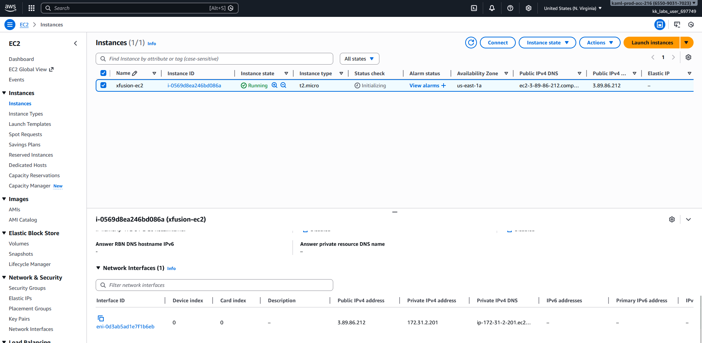

# Day 11: Attach Elastic Network Interface to EC2 Instance

## 📋 Project Overview

Attached an Elastic Network Interface (ENI) to an EC2 instance using AWS CLI. This demonstrates understanding of advanced networking in AWS and how to configure multiple network interfaces on instances.

---

## 🎯 Objective

Attach a network interface to an EC2 instance with the following requirements:
- **Network Interface Name**: `xfusion-eni`
- **Instance Name**: `xfusion-ec2`
- **Method**: AWS CLI

---

## 🛠️ Implementation

### Command Used


```bash
# Attach Elastic Network Interface to EC2 instance
aws ec2 attach-network-interface \
  --network-interface-id eni-0885f274f85d4238f \
  --instance-id i-0569d8ea246bd086a \
  --device-index 1
```

**Syntax Breakdown:**
- `attach-network-interface` - Attaches an ENI to an instance
- `--network-interface-id` - The ENI to attach (starts with `eni-`)
- `--instance-id` - The EC2 instance to attach to
- `--device-index` - The device position (0 is primary, 1 is first additional)

---

### Verification



✅ **Network interface successfully attached!**

---

## 📚 What I Learned

### **What is an Elastic Network Interface (ENI)?**

An ENI is a virtual network card that you can attach to an EC2 instance.

**Think of it as:** A network adapter, like the ethernet or Wi-Fi card in a physical computer, but in the cloud.

**What an ENI includes:**
- Primary private IPv4 address
- One or more secondary private IPv4 addresses
- One Elastic IP per private IPv4 address
- One public IPv4 address
- One or more security groups
- A MAC address

---

### **Common ENI Use Cases**

**1. Network Separation:**
```
Management Traffic → eth0 (10.0.1.x subnet)
Application Traffic → eth1 (10.0.2.x subnet)
```

**2. Failover Solution:**
```
Primary Instance (failed) ← Detach ENI
Secondary Instance ← Attach same ENI (keeps same IP/MAC)
```

**3. License Tied to MAC Address:**
Some software licenses are tied to MAC address. Moving ENI = keeping license valid.

**4. Different Security Groups:**
```
eth0 → Security Group A (management access)
eth1 → Security Group B (public access)
```

---

## 🔑 Key Takeaways

1. **ENI = Virtual Network Card**: Like adding another ethernet port to your server

2. **Device Index Matters**: 0 is primary (can't detach), 1+ are additional (can detach)

3. **ENIs are Independent**: Can exist without being attached to an instance

4. **Primary vs Additional**: Primary is permanent, additional can be moved between instances

5. **Multiple IPs per Instance**: Each ENI has its own IP address(es)

6. **Useful for Network Segmentation**: Separate management and application traffic

---

## 💡 Real-World Use Case

**Scenario: High-Availability Web Server**

A company needs to minimize downtime for their web server:

**Setup:**
- Create an ENI with the public-facing IP address
- Attach it to Instance A (primary server)

**When Instance A fails:**
```bash
# Detach ENI from failed instance
aws ec2 detach-network-interface --attachment-id eni-attach-xxxxx

# Attach ENI to Instance B (standby server)
aws ec2 attach-network-interface \
  --network-interface-id eni-xxxxx \
  --instance-id i-instance-b \
  --device-index 1
```

**Result:**
- Same IP address, same MAC address
- DNS doesn't need to change
- Failover in under 2 minutes
- Users experience minimal downtime

---

## 📖 Resources

- [AWS Elastic Network Interface Documentation](https://docs.aws.amazon.com/AWSEC2/latest/UserGuide/network-interface-attachments.html)
- [AWS CLI attach-network-interface Reference](https://docs.aws.amazon.com/cli/latest/reference/ec2/attach-network-interface.html)

---

## ✅ Project Status

**Status**: Completed ✅  
**Date**: January 31, 2026  
**Instance Name**: `xfusion-ec2`  
**Instance ID**: `i-0569d8ea246bd086a`  
**Network Interface Name**: `xfusion-eni`  
**Network Interface ID**: `eni-0885f274f85d4238f`  
**Device Index**: `1` (eth1)  
**Method**: AWS CLI  

---

## 🤔 Reflection

**What I Learned:**
- ENIs are virtual network cards that can be attached to EC2 instances
- Device index 0 is the primary ENI (cannot detach), index 1+ are additional
- ENIs can be detached and moved between instances
- Each ENI has its own IP address and security groups

**Key Insight:**
This is more advanced networking than what I've done so far. ENIs allow for flexible network configurations - you can separate traffic types, create failover solutions, or run network appliances. The ability to detach and move ENIs between instances is powerful for high-availability scenarios.

**Professional Takeaway:**
Understanding ENIs is important for advanced AWS networking. While most simple applications only need the primary ENI, production environments often use multiple ENIs for security segmentation or high-availability setups.

---

**Tags**: #AWS #EC2 #ENI #ElasticNetworkInterface #Networking #CLI #AdvancedNetworking #100DaysOfCloud
