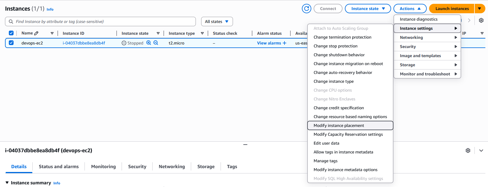
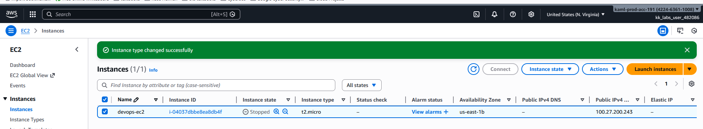

# Day 7: Change EC2 Instance Type

## 📋 Project Overview

Modified an existing EC2 instance type from `t2.micro` to `t2.nano` using the AWS Console. This project demonstrates understanding of instance right-sizing, the importance of stopping instances before modifications, and cost optimization strategies in AWS.

---

## 🎯 Objective

Change the instance type of an existing EC2 instance with the following requirements:
- **Instance Name**: `devops-ec2`
- **Original Type**: `t2.micro`
- **New Type**: `t2.nano`
- **Final State**: Running

---

## 🛠️ Implementation

### Method: AWS Console (Web Interface)

**Step 1: Stop the Instance**
- Navigate to EC2 Dashboard → Instances
- Select the `devops-ec2` instance
- **Instance State** → **Stop Instance**
- ⚠️ Wait for instance state to show "Stopped"

> **Important:** You CANNOT change instance type while the instance is running!

---

**Step 2: Change Instance Type**



- Select the stopped `devops-ec2` instance
- **Actions** → **Instance Settings** → **Change Instance Type**


- In the dialog box, select **t2.nano** from the dropdown
- Click **Apply**

---

**Step 3: Start the Instance**



- Select the `devops-ec2` instance
- **Instance State** → **Start Instance**
- ✅ Verify instance is in **Running** state
- ✅ Verify instance type shows **t2.nano**

---

## 📚 What I Learned

### **1. Why You Must Stop the Instance First**

**The Rule:** Instance type changes require the instance to be stopped.

**Why?**
- Changing instance type means changing the underlying hardware
- AWS needs to migrate your instance to different physical hardware
- This cannot happen while the OS is running and processes are active

**Think of it like:**
Upgrading a car engine - you can't do it while the car is driving!

**Process:**
```
Running → Stop → Change Type → Start → Running (on new hardware)
```

**What Happens During Stop/Start:**
1. **Stop**: OS shuts down cleanly, state saved to EBS volume
2. **Change Type**: AWS allocates new hardware resources
3. **Start**: Instance boots on new hardware type with same data

---

### **2. t2.micro vs t2.nano Comparison**

**Understanding the Downgrade:**

| Specification | t2.nano | t2.micro |
|---------------|---------|----------|
| **vCPUs** | 1 | 1 |
| **Memory** | 0.5 GiB | 1 GiB |
| **Network Performance** | Low | Low to Moderate |
| **CPU Credits/Hour** | 3 | 6 |
| **Baseline CPU %** | 5% | 10% |
| **Cost (us-east-1)** | ~$0.0058/hr | ~$0.0116/hr |
| **Monthly Cost** | ~$4.25 | ~$8.50 |

**Key Difference:** t2.nano has **50% less RAM** and **50% fewer CPU credits**

---

### **3. When to Use t2.nano vs t2.micro**

**Use t2.nano when:**
- ✅ Running very lightweight applications
- ✅ Hosting simple static websites
- ✅ Running scheduled scripts/cron jobs
- ✅ Cost optimization is critical
- ✅ Application uses < 512 MB memory
- ✅ Low traffic (< 100 requests/hour)

**Use t2.micro when:**
- ✅ Running dynamic websites
- ✅ Small databases
- ✅ Development/testing environments
- ✅ Applications need more memory
- ✅ Moderate traffic (100-1000 requests/hour)

**Example Real-World Scenarios:**

**t2.nano is perfect for:**
```
- Personal blog with static content
- Redirect server
- Lightweight monitoring agent
- VPN endpoint
- DNS server
```

**t2.micro is better for:**
```
- WordPress site
- Small API server
- Development database
- Jenkins build agent
- Docker container host
```

---

## 🔑 Key Takeaways

1. **Must Stop Before Changing**: Cannot modify instance type on running instances

2. **Data is Safe**: EBS volumes persist through instance type changes

3. **Right-Sizing Saves Money**: t2.nano costs 50% less than t2.micro

4. **Performance Trade-offs**: Less RAM and CPU credits may impact application

5. **Public IP May Change**: Use Elastic IP if you need a static public IP

6. **No Free Tier for t2.nano**: Only t2.micro is free tier eligible

7. **Monitor After Changes**: Verify application still performs acceptably

8. **Reversible Process**: Can always change back if needed

---

## ✅ Project Status

**Status**: Completed ✅  
**Date**: January 29, 2026  
**Instance Name**: `devops-ec2`  
**Previous Type**: t2.micro  
**New Type**: t2.nano  
**Final State**: Running ✅  
**Data Loss**: None  
**Downtime**: ~2-3 minutes (stop → change → start)  

---

## 🤔 Reflection

**What I Learned:**
- Instance type changes require stopping the instance first
- The difference between t2.nano and t2.micro (RAM and CPU credits)
- Right-sizing is an important cost optimization strategy
- Data on EBS volumes persists through instance changes

**What Surprised Me:**
- How quick the process was (just a few clicks)
- That the instance ID and private IP stayed the same
- The significant cost difference between t2.nano and t2.micro

**What I'll Do Next Time:**
- Create an AMI snapshot before making changes (as a backup)
- Use CloudWatch to determine optimal instance size before changing
- Try using AWS CLI instead of console for automation practice
- Monitor instance performance for 24 hours after change

**Key Insight:**
This exercise taught me that cloud resources are flexible and easily adjustable - you're not locked into your initial choices. This flexibility is one of the core advantages of cloud computing over traditional on-premise infrastructure!

---

**Tags**: #AWS #EC2 #InstanceType #RightSizing #CostOptimization #t2nano #CloudComputing #100DaysOfCloud
