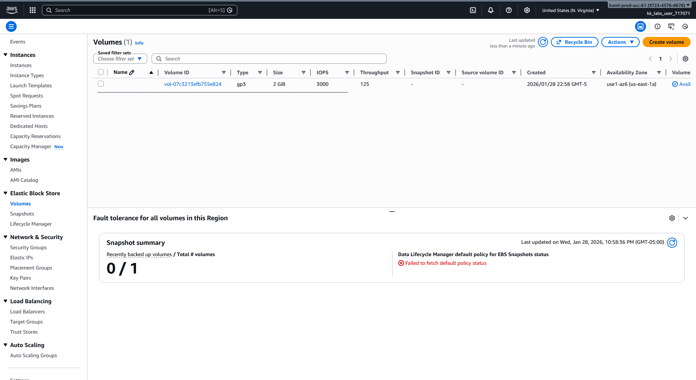
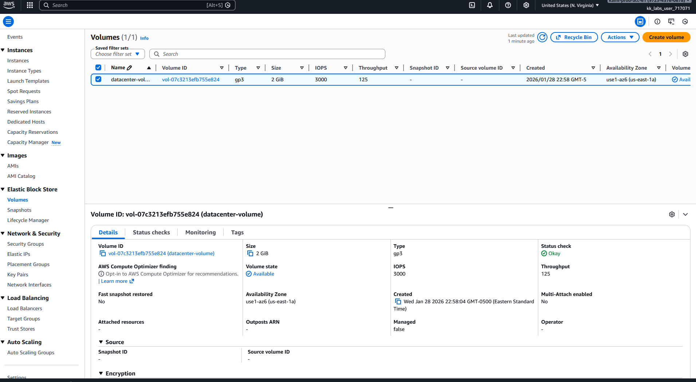

# Day 5: Create GP3 Volume

## 📋 Project Overview

Created an AWS EBS (Elastic Block Store) volume using the AWS CLI with GP3 volume type for improved performance and cost efficiency. Learned about EBS naming conventions and the relationship between EC2 and EBS services in the AWS CLI.

---

## 🎯 Objective

Create an EBS volume with the following specifications:
- **Name**: `datacenter-volume`
- **Volume Type**: `gp3`
- **Size**: `2 GiB`
- **Availability Zone**: `us-east-1a`

---

## 🛠️ Implementation

### Step 1: Create the Volume (Without Name)


```bash
# Create GP3 volume
aws ec2 create-volume \
  --volume-type gp3 \
  --size 2 \
  --availability-zone us-east-1a
```

**Result:** Volume created successfully, but without a name tag.



---

### Step 2: Add Name Tag via AWS Console

Since the CLI command didn't include the name, I added it manually through the AWS Console:

1. Navigate to EC2 → Volumes
2. Select the volume
3. Add tag: `Name` = `datacenter-volume`



---

## 📚 What I Learned

### **1. Why "aws ec2" for EBS Volumes? (Initial Confusion)**

**My Confusion:** The service is called **EBS** (Elastic Block Store), so why does the CLI use `aws ec2` instead of `aws ebs`?

**Answer:**
- EBS volumes are **part of the EC2 service** in AWS
- EBS volumes exist to provide storage **for EC2 instances**
- The AWS CLI groups EBS commands under the `ec2` namespace because they're tightly coupled
- There is NO separate `aws ebs` command - everything is `aws ec2 <volume-command>`
---

### **2. How to Name Resources in AWS CLI**

**The Problem:** AWS doesn't have a `--name` parameter. Names are actually **tags**.

**How Tags Work:**
- In AWS, the "Name" you see in the console is actually a **tag** with Key=`Name`
- Tags are key-value pairs attached to resources
- The `Name` tag is special - it displays as the resource name in the console
- You can add multiple tags during creation

---

## 🔑 Key Takeaways

1. **EBS Commands Use `ec2` Namespace**: EBS is part of EC2 service, so all commands use `aws ec2`

2. **Names Are Tags**: The "Name" field in AWS console is actually a tag with `Key=Name`

3. **Tag During Creation**: Use `--tag-specifications` to name resources in one command instead of manual console work

4. **GP3 is the Default**: Always use GP3 for new volumes - better performance, lower cost

5. **Availability Zones Are Critical**: EBS volumes must be in the same AZ as the EC2 instance they'll attach to

6. **CLI Over Console**: Could have done everything in one CLI command - no console clicking needed

---


## 📖 Resources

- [AWS EBS Volume Creation Documentation](https://docs.aws.amazon.com/ebs/latest/userguide/ebs-creating-volume.html)

---


## ✅ Project Status

**Status**: Completed ✅  
**Date**: January 28, 2026  
**Volume Name**: `datacenter-volume`  
**Volume Type**: GP3  
**Size**: 2 GiB  
**Availability Zone**: us-east-1a  

**Key Learning**: Discovered the importance of `--tag-specifications` for naming resources via CLI

---

## 🤔 Questions I Had (And Answered)

**Q: Why does it say `aws ec2` and not `aws ebs`?**  
A: EBS is part of the EC2 service. There is no separate `aws ebs` command.

**Q: How do I add a name using the CLI?**  
A: Use `--tag-specifications` with `Key=Name,Value=<your-name>`

**Q: Can I rename a volume later?**  
A: Yes! Just update the Name tag using `aws ec2 create-tags`

**Q: Do I need to specify availability zone?**  
A: Yes, it's required. Volumes are AZ-specific.

---

**Tags**: #AWS #EBS #GP3 #Storage #CLI #EC2 #Tagging #100DaysOfCloud
