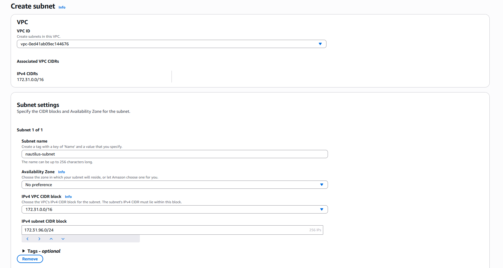

# Day 3: Creating AWS Subnet

## The Task

I needed to create one subnet named `nautilus-subnet` under the default VPC.

## My Thought Process

### Understanding the Basics

Before jumping in, I wanted to understand what I was actually doing. A subnet is basically a subdivision of a VPC's IP address space. The VPC is like the whole neighborhood, and subnets are like individual streets within it.

### The CIDR Block Confusion

This was the tricky part. I saw my VPC had a CIDR block of `172.31.0.0/16`, and I needed to pick a subnet CIDR that fit within it.

**First attempt**: I tried `172.31.0.0/24`
- Seemed like a reasonable number to me
- **Result**: Error! "CIDR Address overlaps with existing Subnet CIDR: 172.31.0.0/20"

### What I Learned About CIDR Blocks

Turns out there was already a subnet using `172.31.0.0/20`. I had to learn what that `/20` actually means:
- A `/20` is way bigger than a `/24`
- `172.31.0.0/20` covers addresses from 172.31.0.0 to 172.31.95.255

## The Creation Process

I navigated to VPC → Subnets → Create subnet, then filled in:
- Selected my default VPC
- Named it `nautilus-subnet`
- Picked an availability zone
- Set the IPv4 CIDR block to `172.31.96.0/24`

## Reflections

**What confused me**:
- CIDR notation is weird at first. Why is `/16` bigger than `/24`? (Smaller number = more addresses)
- Understanding which CIDR blocks overlap
- Why AWS reserves 5 IP addresses (turns out it's for network address, router, DNS, future use, and broadcast)

**What I'd do differently**:
- Check existing subnets first before picking a CIDR block
- Maybe plan out my subnet strategy if I was doing multiple subnets
- Keep a simple numbering scheme like 0, 1, 2, 3 for different subnets

**Cool things I noticed**:
- AWS makes this pretty straightforward once you understand CIDR
- The error messages are actually helpful
- It's reversible - you can delete and recreate if needed

---

*January 2026 - Learning AWS Networking*
