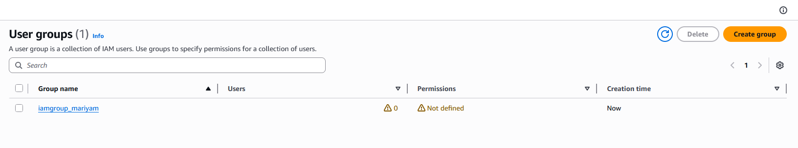

# Day 17: Create IAM Group

## 📋 Project Overview

Created an IAM group using AWS CLI as part of the Nautilus DevOps team's cloud migration strategy. Groups allow efficient permission management by organizing users with similar access needs together, rather than managing permissions individually.

---

## 🎯 Objective

Create an IAM group with the following requirements:
- **Group Name**: `iamgroup_mariyam`
- **Method**: AWS CLI

---

## 🛠️ Implementation

### Command Used


```bash
# Create IAM group
aws iam create-group --group-name iamgroup_mariyam
```

**Syntax Breakdown:**
- `aws iam` - The IAM service namespace
- `create-group` - Creates a new IAM group
- `--group-name` - The name for the new group

---

### Command Output

```json
{
    "Group": {
        "Path": "/",
        "GroupName": "iamgroup_mariyam",
        "GroupId": "AGPAZZMCMZT32TQDGWKIG",
        "Arn": "arn:aws:iam::672972721399:group/iamgroup_mariyam",
        "CreateDate": "2026-02-18T07:08:28Z"
    }
}
```

**Output Explanation:**
- `Path` - Organizational path (`/` = root, default)
- `GroupName` - Confirms the group name `iamgroup_mariyam`
- `GroupId` - Unique internal ID assigned by AWS (starts with `AGPA`)
- `Arn` - Amazon Resource Name for this group
- `CreateDate` - Timestamp when the group was created

---

### Verification



✅ **IAM group successfully created!**

---

## 📚 What I Learned

### **What is an IAM Group?**

An IAM group is a **collection of IAM users** that share the same permissions.

**Think of it as:** A team or department in your organization.

**Key Concept:**
- Attach permissions to the **group** (not individual users)
- Add **users** to the group
- All users in the group automatically inherit the group's permissions

---

### **Why Use Groups?**

**Without Groups (Managing Individual Users):**
```
10 developers × Attach 5 policies each = 50 policy attachments
Developer leaves → Remove 5 policies
New developer → Attach 5 policies
Change permission → Update 10 users individually
```

**With Groups:**
```
1 group × Attach 5 policies = 5 policy attachments
Developer leaves → Remove from group (1 action)
New developer → Add to group (1 action)
Change permission → Update group (1 action, affects all)
```

**Groups make permission management scalable!**

---

### **Group ID Prefix**

Like User IDs, Group IDs have unique prefixes:

| Resource | ID Example | Prefix |
|----------|-----------|--------|
| User | `AIDAVHK4X3EUI3ZDFFDPO` | `AIDA` |
| Group | `AGPAZZMCMZT32TQDGWKIG` | `AGPA` |
| Role | `AROAI...` | `AROA` |
| Policy | `ANPAI...` | `ANPA` |

**These prefixes help identify the resource type in AWS logs and APIs.**

---

### **Groups vs Users vs Roles**

| IAM Resource | Represents | Can Log In? | Can Assume? |
|--------------|------------|-------------|-------------|
| **User** | Person or application | Yes (with password) | No |
| **Group** | Collection of users | No | No |
| **Role** | Set of permissions | No | Yes (temporarily) |

**Key Difference:**
- **Users** = identities that can authenticate
- **Groups** = organizational containers for users
- **Roles** = permissions that can be assumed temporarily (Day 20)

---

## 🔑 Key Takeaways

1. **Groups Organize Users**: Collections of users with shared permissions

2. **Scalable Permission Management**: Change group policy → affects all members

3. **Groups Cannot Log In**: Groups are organizational only, not identities

4. **No Nesting**: Groups cannot contain other groups

5. **Zero Permissions by Default**: Must attach policies to grant access

6. **Multiple Group Membership**: Users can belong to multiple groups

7. **Group ID Starts with AGPA**: Identifies resource type in AWS

---

## 📖 Resources

- [AWS CLI create-group Reference](https://docs.aws.amazon.com/cli/latest/reference/iam/create-group.html)
- [IAM Groups Documentation](https://docs.aws.amazon.com/IAM/latest/UserGuide/id_groups.html)
- [IAM Best Practices - Use Groups](https://docs.aws.amazon.com/IAM/latest/UserGuide/best-practices.html#use-groups-for-permissions)

---

## ✅ Project Status

**Status**: Completed ✅  
**Date**: February 18, 2026  
**Group Name**: `iamgroup_mariyam`  
**Group ID**: `AGPAZZMCMZT32TQDGWKIG`  
**ARN**: `arn:aws:iam::672972721399:group/iamgroup_mariyam`  
**Path**: `/`  
**Created**: `2026-02-18T07:08:28Z`  
**Method**: AWS CLI  

---

## 🤔 Reflection

**What I Learned:**
- IAM groups are containers for organizing users with similar permissions
- Groups make permission management scalable (change once, affects all members)
- Groups cannot log in or authenticate - they are organizational only
- Groups have zero permissions by default, just like users
- Groups cannot contain other groups (flat structure)

**Key Insight:**
This is Day 2 of the IAM series. The pattern is becoming clear:
- Day 16: Create user (identity)
- Day 17: Create group (organization)
- Day 18: Create policy (permissions definition)
- Day 19: Connect them together

IAM is like building with LEGO blocks - each piece has a specific purpose, and they snap together to create access control.

**Migration Strategy Connection:**
The Nautilus DevOps team's approach of breaking down migration into smaller tasks is smart. Rather than giving everyone admin access, they're building proper IAM structure:
1. Create users (Day 16)
2. Create groups (Day 17)
3. Define what those groups can do (Days 18-19)

This "principle of least privilege" approach is fundamental to cloud security.

**Professional Takeaway:**
In production AWS environments, **never** attach policies directly to users. Always use groups. When someone says "give me access to S3," the answer is not "let me attach a policy to your user," it's "let me add you to the s3-users group." This makes managing hundreds of users actually possible.

---

**Tags**: #AWS #IAM #Groups #AccessControl #Security #PermissionManagement #CLI #100DaysOfCloud
