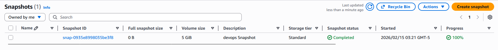

# Day 15: Create Volume Snapshot

## 📋 Project Overview

Created a snapshot of an existing EBS volume using AWS CLI as part of setting up automated backups. This demonstrates understanding of data backup strategies and how to protect important data through point-in-time snapshots.

---

## 🎯 Objective

Create a snapshot of an existing EBS volume with the following requirements:
- **Source Volume**: `devops-vol`
- **Snapshot Name**: `devops-vol-ss`
- **Description**: `devops Snapshot`
- **Region**: `us-east-1`
- **Final State**: `completed`
- **Method**: AWS CLI

---

## 🛠️ Implementation

### Shell Script


```bash
# Create snapshot of devops-vol volume
aws ec2 create-snapshot \
  --volume-id vol-0c282f2ca9496b9b4 \
  --description "devops Snapshot"
```

**Syntax Breakdown:**
- `create-snapshot` - Creates a point-in-time backup of an EBS volume
- `--volume-id` - The source volume to snapshot (starts with `vol-`)
- `--description` - Human-readable description of what the snapshot is

---

### Command Output

```json
{
    "Tags": [],
    "SnapshotId": "snap-0935e8998035be3f8",
    "VolumeId": "vol-0c282f2ca9496b9b4",
    "State": "pending",
    "StartTime": "2026-02-15T08:21:21.474Z",
    "Progress": "",
    "OwnerId": "039723078141",
    "Description": "devops Snapshot",
    "VolumeSize": 5,
    "Encrypted": false
}
```

**Output Explanation:**
- `SnapshotId` - Unique ID of the snapshot (`snap-0935e8998035be3f8`)
- `VolumeId` - Confirms which volume was snapshotted
- `State` - `pending` initially → changes to `completed` when done
- `StartTime` - Timestamp when snapshot began
- `Progress` - Percentage complete (empty when just started)
- `OwnerId` - AWS account that owns the snapshot
- `VolumeSize` - Source volume size (5 GB)
- `Encrypted` - Whether the volume is encrypted (`false`)

---

### Verification



✅ **Snapshot successfully created and in completed state!**

---

## 📚 What I Learned

### **What is an EBS Snapshot?**

A snapshot is a **point-in-time backup** of an EBS volume stored in Amazon S3.

**Think of it as:** Taking a photograph of your hard drive at a specific moment in time.

**Key Characteristics:**
- Captures data as it exists at the moment of creation
- Stored in S3 (managed by AWS, not visible in S3 console)
- Incremental after first snapshot (only changed data is saved)
- Can be used to create new volumes
- Can be copied across regions

---

### **Snapshot States**

| State | Meaning |
|-------|---------|
| `pending` | Snapshot is being created |
| `completed` | Snapshot is ready to use ✅ |
| `error` | Snapshot failed |
| `recoverable` | Can be recovered |
| `recovering` | Being recovered |

**In our case:**
```
pending → completed
```
The snapshot starts as `pending` and must reach `completed` before use.

---

### **How Snapshots Work (Incremental)**

**First Snapshot (Full):**
```
Volume: 5 GB used
First Snapshot: 5 GB stored (full copy)
Cost: Pay for 5 GB
```

**Second Snapshot (Incremental):**
```
Volume: Changed 1 GB since last snapshot
Second Snapshot: Only 1 GB stored (just the changes)
Cost: Pay for 1 GB additional
Total stored: 6 GB (5 original + 1 new)
```

**This makes snapshots cost-efficient for regular backups!**

---

### **Snapshot Use Cases**

**1. Regular Backups:**
```bash
# Automate with cron (daily backup)
0 2 * * * aws ec2 create-snapshot \
  --volume-id vol-xxx \
  --description "Automated daily backup"
```

**2. Before Risky Changes:**
```bash
# Snapshot before major update
aws ec2 create-snapshot \
  --volume-id vol-xxx \
  --description "Pre-update backup - before v2.0 deploy"

# Make changes...
# If something breaks, restore from snapshot
```

**3. Create Volume in Different AZ:**
```bash
# Volume stuck in us-east-1a but need it in us-east-1b?
# 1. Snapshot the volume
aws ec2 create-snapshot --volume-id vol-xxx

# 2. Create new volume from snapshot in different AZ
aws ec2 create-volume \
  --snapshot-id snap-xxx \
  --availability-zone us-east-1b
```

**4. Copy Data to Different Region:**
```bash
# Copy snapshot to another region
aws ec2 copy-snapshot \
  --source-region us-east-1 \
  --source-snapshot-id snap-0935e8998035be3f8 \
  --destination-region eu-west-1 \
  --description "Cross-region disaster recovery backup"
```

---
## 🔑 Key Takeaways

1. **Snapshots are Point-in-Time Backups**: Captures data exactly as it was when the snapshot was taken

2. **Incremental After First**: Only changes are stored, making backups cost-efficient

3. **`pending` → `completed`**: Must wait for completed state before using snapshot

4. **Names are Tags**: Use `--tag-specifications` or `create-tags` to name snapshots

5. **Stored in S3**: AWS manages storage, not visible in S3 console

6. **Cross-Region Capable**: Snapshots can be copied to other regions for disaster recovery

7. **Foundation for Automation**: Snapshots are the basis of AWS Backup and automated backup strategies

---

## 💡 Real-World Backup Strategy

**Scenario: Automated Backup Policy for DevOps Team**

The Nautilus DevOps team wants automated backups. A complete strategy:

```bash
# Daily snapshots (automated via AWS EventBridge or cron)
aws ec2 create-snapshot \
  --volume-id vol-0c282f2ca9496b9b4 \
  --description "Daily automated backup - devops-vol" \
  --tag-specifications 'ResourceType=snapshot,Tags=[
    {Key=Name,Value=devops-vol-daily},
    {Key=Retention,Value=7days},
    {Key=Team,Value=devops}
  ]'
```

**Retention Policy:**
- Daily snapshots → Keep 7 days
- Weekly snapshots → Keep 4 weeks
- Monthly snapshots → Keep 12 months

**Cost Estimate:**
```
5 GB volume
Daily changes: ~100 MB
7 daily snapshots: 5 GB + (6 × 100 MB) = ~5.6 GB
Cost: ~$0.28/month (at $0.05/GB)
```

---

## 📖 Resources

- [AWS CLI create-snapshot Reference](https://docs.aws.amazon.com/cli/latest/reference/ec2/create-snapshot.html)
- [EBS Snapshots Documentation](https://docs.aws.amazon.com/AWSEC2/latest/UserGuide/EBSSnapshots.html)

---

## ✅ Project Status

**Status**: Completed ✅  
**Date**: February 15, 2026  
**Volume Name**: `devops-vol`  
**Volume ID**: `vol-0c282f2ca9496b9b4`  
**Volume Size**: 5 GB  
**Snapshot Name**: `devops-vol-ss`  
**Snapshot ID**: `snap-0935e8998035be3f8`  
**Description**: `devops Snapshot`  
**Region**: `us-east-1`  
**Initial State**: `pending`  
**Final State**: `completed` ✅  
**Encrypted**: `false`  
**Method**: AWS CLI  

---

## 🤔 Reflection

**What I Learned:**
- Snapshots are point-in-time backups of EBS volumes stored in S3
- Snapshots start as `pending` and transition to `completed`
- After the first full snapshot, subsequent snapshots are incremental
- Names must be added as tags, similar to volumes and instances
- Snapshots can be used to create new volumes or restore data

**Key Insight:**
This day completes the storage backup picture:
- Day 13: AMI = full instance backup
- Day 15: Snapshot = single volume backup

Both are important but serve different purposes. AMIs are for recovering an entire server setup; snapshots are for recovering specific data volumes. In production, you need both.

**Professional Takeaway:**
Snapshots are the foundation of any AWS backup strategy. They are incremental, cost-efficient, and cross-region capable. Understanding how to automate them is a critical cloud engineering skill - the Nautilus DevOps team's requirement for automated backups is exactly the kind of real-world scenario I'll encounter in a cloud role.

---

**Tags**: #AWS #EBS #Snapshot #Backup #DisasterRecovery #DataProtection #CLI #100DaysOfCloud
