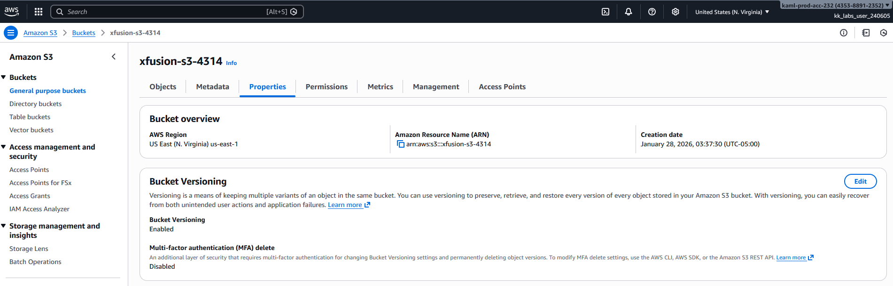

# Day 4: Enable Versioning for S3 Bucket

## 📋 Project Overview

Enabled versioning on an AWS S3 bucket using the AWS CLI to protect against accidental deletions and overwrites. This project demonstrates infrastructure automation and S3 data protection best practices.

---

## 🎯 Objective

Enable versioning on the S3 bucket `xfusion-s3-4314` to maintain multiple versions of objects and allow recovery of deleted or overwritten files.

---

## 🛠️ Implementation

### Commands Used
Script:   

```bash
# Enable versioning in S3 bucket xfusion-s3-4314
aws s3api put-bucket-versioning \
  --bucket xfusion-s3-4314 \
  --versioning-configuration Status=Enabled
```

### Verification

After enabling versioning, verified the configuration through the AWS Console:



---

## 📚 What I Learned

### **S3 Versioning Concepts**

1. **Version Control for Objects**
   - Every object uploaded to a versioned bucket gets a unique version ID
   - Previous versions are retained when objects are overwritten
   - Deleted objects become "delete markers" rather than being permanently removed

2. **Benefits of Versioning**
   - **Accidental Deletion Protection**: Recover objects that were accidentally deleted
   - **Overwrite Protection**: Retrieve previous versions if a file is overwritten
   - **Compliance**: Meet regulatory requirements for data retention
   - **Audit Trail**: Track changes to objects over time

3. **How Versioning Works**
   - When versioning is enabled, S3 assigns a unique version ID to each object
   - Uploading a new object with the same key creates a new version
   - The latest version is always returned by default
   - Previous versions remain accessible using their version IDs
   - Deleting an object creates a delete marker (object can still be recovered)

4. **Storage Considerations**
   - Each version counts toward storage costs
   - Need to implement lifecycle policies to manage old versions
   - Can transition old versions to cheaper storage classes (S3 Glacier, etc.)

---

## 🔑 Key Takeaways

1. **Versioning is a Safety Net**: Protects against accidental data loss and provides rollback capabilities

2. **CLI Over Console**: Using AWS CLI is faster, more professional, and essential for automation

3. **Version IDs Matter**: S3 assigns unique version IDs to track object history

4. **Delete Markers**: Deleted objects aren't truly gone - they're marked for deletion and can be recovered

5. **Cost Awareness**: Multiple versions increase storage costs - implement lifecycle policies to manage this

6. **Enable Early**: It's easier to enable versioning from the start than to deal with data loss later

---

## 📖 Resources

- [AWS S3 Versioning Documentation](https://docs.aws.amazon.com/AmazonS3/latest/userguide/manage-versioning-examples.html)
- [AWS CLI S3API Reference](https://docs.aws.amazon.com/cli/latest/reference/s3api/put-bucket-versioning.html)

---

## 🔄 Next Steps

- Learn how to retrieve specific object versions
- Implement S3 lifecycle policies to automatically delete old versions
- Practice restoring deleted objects using version IDs
- Explore versioning with S3 replication for disaster recovery

---

## 💡 Real-World Applications

**When to Use S3 Versioning:**
- **Backup Systems**: Maintain historical versions of backup files
- **Content Management**: Track changes to website assets or documentation
- **Data Lakes**: Preserve data lineage and enable time-travel queries
- **Compliance**: Meet regulatory requirements for data retention
- **Development**: Allow developers to roll back to previous application builds

**Example Use Case:**
A company stores configuration files in S3. With versioning enabled, if a bad configuration is accidentally uploaded, they can instantly roll back to the previous working version without data loss.

---

## ✅ Project Status

**Status**: Completed ✅  
**Date**: January 27, 2026  
**Bucket**: `xfusion-s3-4314`  
**Versioning**: Enabled

---

**Tags**: #AWS #S3 #Versioning #CLI #CloudStorage #DataProtection #100DaysOfCloud
