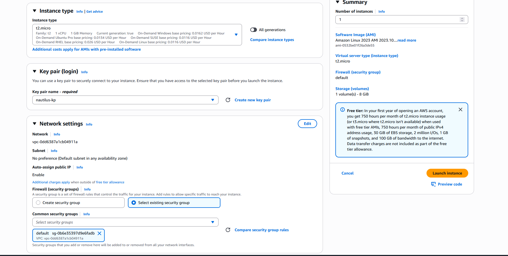
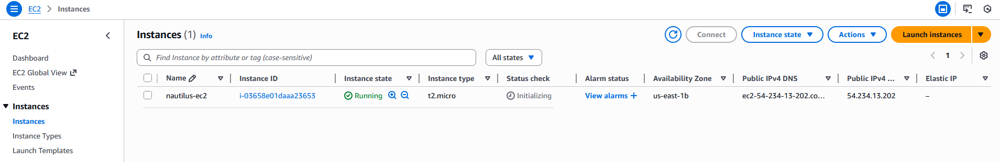

# Day 6: Launch EC2 Instance

## 📋 Project Overview

Launched an Amazon EC2 (Elastic Compute Cloud) instance using the AWS Console. This project demonstrates the fundamentals of cloud compute services, including instance configuration, AMI selection, instance types, key pair creation, and security group attachment.

---

## 🎯 Objective

Launch an EC2 instance with the following specifications:
- **Instance Name**: `nautilus-ec2`
- **AMI**: Amazon Linux
- **Instance Type**: `t2.micro`
- **Key Pair**: Create new RSA key pair named `nautilus-kp`
- **Security Group**: Default security group

---

## 🛠️ Implementation

### Method: AWS Console (Web Interface)

**Step 1: Navigate to EC2 Dashboard**
- Go to AWS Console → EC2 → Instances → Launch Instance

**Step 2: Configure Instance Settings**

- **Name**: `nautilus-ec2`
- **AMI**: Amazon Linux 2023 (or Amazon Linux 2)
- **Instance Type**: `t2.micro` (Free tier eligible)
- 


**Step 3: Create Key Pair**
- Selected "Create new key pair"
- **Key pair name**: `nautilus-kp`
- **Key pair type**: RSA
- **Private key file format**: `.pem`
- Downloaded `nautilus-kp.pem` (saved securely)

**Step 4: Network Settings**
- **Security Group**: Selected default security group
- Kept default VPC and subnet settings



**Step 5: Launch Instance**
- Reviewed all settings
- Clicked "Launch Instance"



✅ **Instance successfully launched and running!**

---

## 📚 What I Learned

### **1. What is EC2?**

**EC2 (Elastic Compute Cloud)** is AWS's virtual server service that allows you to:
- Run applications in the cloud
- Scale computing capacity up or down based on demand
- Pay only for what you use (no upfront hardware costs)
- Choose from various instance types optimized for different workloads

**Think of it as:** Renting a computer in the cloud that you can access remotely and configure however you need.

---

### **2. Amazon Machine Images (AMI)**

**What is an AMI?**
- A template that contains the operating system and software configuration
- Determines what OS your EC2 instance will run
- Can be Linux, Windows, or custom images

**Amazon Linux AMI:**
- ✅ **AWS-optimized**: Designed specifically to run well on AWS
- ✅ **Free tier eligible**: No additional cost
- ✅ **Security updates**: Regularly maintained by AWS
- ✅ **Pre-installed tools**: AWS CLI and other AWS tools come pre-configured
- ✅ **Performance**: Optimized for EC2 instances

**Other Common AMIs:**
- Ubuntu Server
- Red Hat Enterprise Linux (RHEL)
- Windows Server
- Amazon Linux 2023 (newest version)

---

### **3. Instance Types (t2.micro)**

**What is an Instance Type?**
Instance types define the hardware resources (CPU, memory, storage, network capacity) of your virtual server.

**t2.micro Breakdown:**

| Component | Specification |
|-----------|---------------|
| **vCPUs** | 1 virtual CPU |
| **Memory** | 1 GiB RAM |
| **Network** | Low to Moderate |
| **Storage** | EBS only |
| **Cost** | Free tier: 750 hours/month |

**The "t2" Family:**
- **t** = Burstable performance (can handle occasional spikes in CPU usage)
- **2** = Generation number (t2 is older, t3/t4 are newer)
- **micro** = Size (nano < micro < small < medium < large...)

**When to Use t2.micro:**
- ✅ Small web applications
- ✅ Development/testing environments
- ✅ Low-traffic websites
- ✅ Learning and experimentation
- ❌ NOT for high-performance computing
- ❌ NOT for databases with heavy workloads

**Burstable Performance Explained:**
- Normally runs at baseline CPU performance
- Can "burst" to higher CPU when needed (accumulated credits)
- Perfect for workloads with occasional spikes

---

### **4. SSH Key Pairs (nautilus-kp)**

**What is a Key Pair?**
A key pair consists of:
- **Private key**: Stored on your computer (`.pem` file) - **KEEP THIS SECRET!**
- **Public key**: Stored on the EC2 instance by AWS

**How SSH Authentication Works:**
1. You try to connect to EC2 instance
2. Instance checks if your private key matches its public key
3. If match → Access granted ✅
4. If no match → Access denied ❌

**Why RSA?**
- Industry-standard encryption algorithm
- Very secure when used with proper key lengths
- Widely supported across all SSH clients

**Key Security Best Practices:**
```bash
# After downloading nautilus-kp.pem, set proper permissions
chmod 400 nautilus-kp.pem

# Move to secure location
mv nautilus-kp.pem ~/.ssh/

# Connect to instance
ssh -i ~/.ssh/nautilus-kp.pem ec2-user@<instance-public-ip>
```

⚠️ **CRITICAL**: 
- Never share your `.pem` file
- Never commit it to Git (add to `.gitignore`)
- If lost, you cannot recover it - you'll need to create a new instance

---

### **5. Security Groups (Default)**

**What is a Security Group?**
A virtual firewall that controls inbound and outbound traffic to your EC2 instance.

**Default Security Group Rules:**
- **Inbound**: 
  - ❌ All traffic from internet is **BLOCKED** by default
  - ✅ Only traffic from other instances in same security group allowed
- **Outbound**: 
  - ✅ All outbound traffic **ALLOWED**

**Why Default Security Group?**
For this learning exercise, the default group was sufficient. However, in real scenarios:

**Production Best Practice:**
```
Create custom security group with specific rules:
- Allow SSH (port 22) from YOUR IP only
- Allow HTTP (port 80) if running web server
- Allow HTTPS (port 443) if running secure web server
- Block everything else
```

**Security Group Example:**

| Type | Protocol | Port | Source | Purpose |
|------|----------|------|--------|---------|
| SSH | TCP | 22 | My IP (203.0.113.0/32) | Remote access |
| HTTP | TCP | 80 | 0.0.0.0/0 | Web traffic |
| HTTPS | TCP | 443 | 0.0.0.0/0 | Secure web traffic |

---

## 🔑 Key Takeaways

1. **EC2 is Virtual Servers**: Cloud-based computers you can rent and configure

2. **AMI Defines the OS**: Amazon Linux is AWS-optimized and perfect for learning

3. **t2.micro is Free Tier**: Perfect for learning and small applications (750 hours/month free)

4. **Key Pairs Enable SSH Access**: Your private key is your password - guard it carefully

5. **Security Groups are Firewalls**: Control what traffic can reach your instance

6. **Console is Great for Learning**: Visual interface helps understand the process before moving to CLI

7. **Instance States**: 
   - Pending → Starting up
   - Running → Active and billable
   - Stopped → Not running, not billable (storage still charged)
   - Terminated → Deleted permanently

---

## 💡 Real-World Context

**Why This Matters:**

EC2 instances are the foundation of cloud computing. In professional environments:

- **Web Hosting**: Host websites and web applications
- **Development Servers**: Provide isolated environments for developers
- **Batch Processing**: Run data processing jobs
- **Game Servers**: Host multiplayer game backends
- **Machine Learning**: Train models on powerful GPU instances
- **Microservices**: Run containerized applications

**Example Scenario:**
A startup launches their MVP (Minimum Viable Product):
1. Start with 1 t2.micro instance (free tier)
2. As users grow, scale up to t2.small, then t2.medium
3. Eventually move to auto-scaling groups that automatically add/remove instances based on traffic
4. Only pay for what they use - no upfront server costs

---


## 📖 Resources

- [AWS EC2 Getting Started Guide](https://docs.aws.amazon.com/AWSEC2/latest/UserGuide/EC2_GetStarted.html)
---

## ✅ Project Status

**Status**: Completed ✅  
**Date**: January 29, 2026  
**Instance Name**: `nautilus-ec2`  
**Instance Type**: t2.micro  
**AMI**: Amazon Linux  
**Key Pair**: `nautilus-kp` (RSA)  
**Security Group**: default  
**State**: Running  

**Method Used**: AWS Console (Web Interface)

---

## 🤔 Reflection

**What Went Well:**
- Successfully launched first EC2 instance
- Created and secured key pair
- Understood the purpose of each configuration option
- Instance is running and accessible

**What I'll Improve:**
- Next time, try using AWS CLI for the same task
- Create a custom security group instead of using default
- Practice SSH connection to the instance
- Learn to use tags more effectively for organization

**Key Learning:**
The AWS Console made it easy to see all the options and understand what each setting does. Now that I understand the concepts, I'll practice doing this via CLI for better automation and repeatability.

---

**Tags**: #AWS #EC2 #Compute #KeyPair #SecurityGroup #AMI #CloudComputing #100DaysOfCloud
