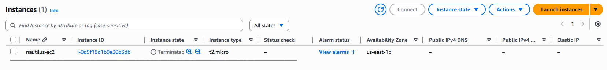

# Day 14: Terminate EC2 Instance

## 📋 Project Overview

Terminated an EC2 instance using AWS CLI. This demonstrates understanding of instance lifecycle management and proper resource cleanup to avoid unnecessary AWS charges.

---

## 🎯 Objective

Terminate an EC2 instance with the following requirements:
- **Instance Name**: `nautilus-ec2`
- **Region**: `us-east-1`
- **Method**: AWS CLI

---

## 🛠️ Implementation

### Command Used


```bash
# Terminate EC2 instance
aws ec2 terminate-instances --instance-id i-0d9f18d1b9a30d3db
```

**Syntax Breakdown:**
- `terminate-instances` - Permanently deletes an EC2 instance
- `--instance-id` - The instance to terminate

---

### Command Output

```json
{
    "TerminatingInstances": [
        {
            "InstanceId": "i-0d9f18d1b9a30d3db",
            "CurrentState": {
                "Code": 32,
                "Name": "shutting-down"
            },
            "PreviousState": {
                "Code": 16,
                "Name": "running"
            }
        }
    ]
}
```

**Output Explanation:**
- `InstanceId` - Confirms which instance is being terminated
- `CurrentState` - `shutting-down` (Code 32) - actively terminating
- `PreviousState` - `running` (Code 16) - what it was before the command
- Instance will transition from `shutting-down` → `terminated`

---

### Verification



## 📚 What I Learned

### **Instance State Codes**

The output shows numeric state codes alongside the state names:

| Code | State | Meaning |
|------|-------|---------|
| `0` | `pending` | Starting up |
| `16` | `running` | Active and running ✅ |
| `32` | `shutting-down` | In process of terminating |
| `48` | `terminated` | Permanently deleted |
| `64` | `stopping` | In process of stopping |
| `80` | `stopped` | Stopped but recoverable |

**In our output:**
- Previous: Code `16` (`running`) → Instance was active
- Current: Code `32` (`shutting-down`) → Termination in progress

---


### **What Happens During Termination**

```
1. Command sent → State: shutting-down (Code 32)
2. OS receives shutdown signal
3. Running processes are stopped
4. Root EBS volume is deleted (default)
5. Instance ID remains visible briefly → State: terminated (Code 48)
6. Instance permanently removed
```

**After Termination:**
- ❌ Instance cannot be recovered
- ❌ Root EBS volume deleted (by default)
- ❌ Instance store data lost
- ✅ Additional EBS volumes may persist (if configured)
- ✅ Elastic IPs released back to account
- ✅ Security groups remain (not deleted)

---

## 🔑 Key Takeaways

1. **Termination is Permanent**: Cannot be undone - double check before running

2. **State Codes Tell the Story**: Code 16 (running) → Code 32 (shutting-down) → Code 48 (terminated)

3. **Root EBS Deleted by Default**: Data on root volume is gone after termination

4. **Different from Stopping**: Stop is reversible, terminate is not

5. **Check Protection First**: Termination protection (Day 9) blocks this command

6. **Always Backup First**: Create AMI (Day 13) before terminating important instances

---

## 💡 Real-World Use Case

**Scenario: Cleaning Up Dev Environment**

A developer spun up 5 EC2 instances for testing over the week:

```bash
# Terminate completed test instances (no longer needed)
aws ec2 terminate-instances \
  --instance-ids i-test1 i-test2 i-test3

# Before: 5 instances × $8.50/month = $42.50/month
# After:  2 instances × $8.50/month = $17.00/month
# Savings: $25.50/month
```

**Good Practice:**
- Terminate instances as soon as they are no longer needed
- Create AMIs first if there is any chance you will need the config again
- Keep environments clean and costs low

---

## 📖 Resources

- [AWS EC2 Termination Documentation](https://docs.aws.amazon.com/AWSEC2/latest/UserGuide/terminating-instances.html)
- [AWS CLI terminate-instances Reference](https://docs.aws.amazon.com/cli/latest/reference/ec2/terminate-instances.html)

---

## ✅ Project Status

**Status**: Completed ✅  
**Date**: February 5, 2026  
**Instance Name**: `nautilus-ec2`  
**Instance ID**: `i-0d9f18d1b9a30d3db`  
**Region**: `us-east-1`  
**Previous State**: `running` (Code 16)  
**Final State**: `shutting-down` → `terminated` (Code 48)  
**Method**: AWS CLI  

---

## 🤔 Reflection

**What I Learned:**
- Termination is permanent and cannot be undone
- State codes show the full instance lifecycle numerically
- The difference between stop (reversible) and terminate (permanent)
- Root EBS volumes are deleted by default on termination
- Always create AMIs before terminating important instances

**Key Insight:**
This day connects Days 8-13 together into a complete lifecycle:
- Day 8: Stop protection (prevent accidental stops)
- Day 9: Termination protection (prevent accidental termination)
- Day 13: Create AMI (backup before terminating)
- Day 14: Terminate (clean up when done)

Full lifecycle: **launch → protect → backup → terminate**

**Professional Takeaway:**
In production, termination is a serious action. Always have backups, check for dependencies, and verify the correct instance ID before terminating. One wrong instance ID can cause a major outage.

---

**Tags**: #AWS #EC2 #Termination #InstanceLifecycle #ResourceCleanup #CostOptimization #100DaysOfCloud
